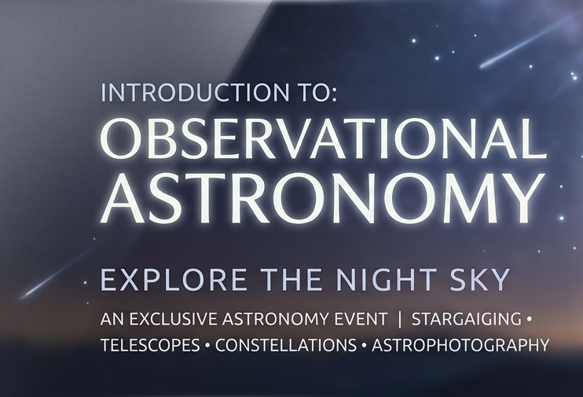
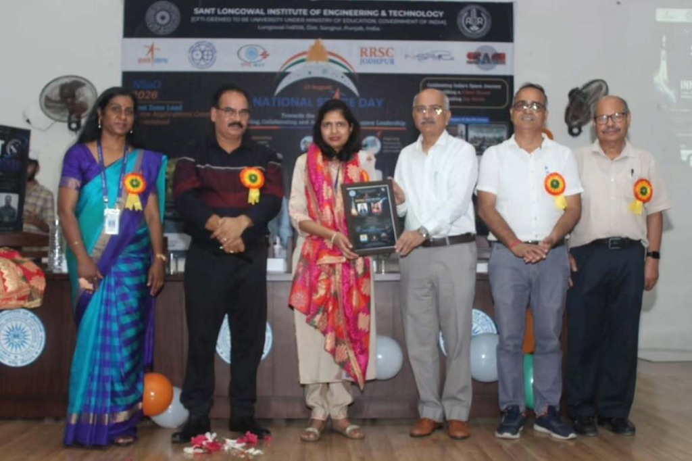

# 🚀 SLIET Antriksha Vigyan Society - Beginner Editing & Maintenance Guide

This simple guide will help any beginner, student executive, or web manager update the website text, Google Form links, team photos, events, and projects in under **2 minutes**.

---

## 🎨 1. How to Update the Website Logo & Favicon

All website graphics are stored in the **`images/`** folder:
- **`images/logo.png`**: Top-left navigation bar society logo.
- **`images/favicon.png`**: Small icon displayed in browser tabs and bookmarks.
- **`images/rk_mishra.png`**: Faculty Head photo.
- **`images/google_forms.svg`**: Icon used in modal dialogs.

### 🌟 Method A: Update Logo WITHOUT Changing Any Code (Recommended)
1. Save your new logo as a PNG image named **`logo.png`**.
2. Save a square (1:1 ratio) version of your logo named **`favicon.png`** (192x192 px recommended).
3. Upload both into the **`images/`** folder (overwriting the old `images/logo.png` and `images/favicon.png`).
4. Refresh your browser — the website logo and browser tab icon will automatically update!

### 🛠️ Method B: Update Logo if Using a New Filename or Format (e.g., `new_logo.svg`)
If your new logo is named differently (e.g., **`images/club_logo.png`** or **`images/logo.svg`**):
1. Upload the file into the **`images/`** folder.
2. Open **`index.html`** in any code editor.
3. Press `Ctrl + F` (or `Cmd + F`) and search for **`images/logo.png`**.
4. Replace `images/logo.png` with your new image path (e.g., `images/club_logo.png`):
   - **Navbar Logo** (around line 125):
     ```html
     
     ```
   - **SEO Metadata & Structured Data** (around line 20 and line 50):
     ```html
     <meta property="og:image" content="https://slietantriksha.ac.in/images/club_logo.png">
     ```
     ```json
     "logo": "https://slietantriksha.ac.in/images/club_logo.png"
     ```

---

## 📷 2. How to Update Faculty & Team Photos

### 🌟 Method A: Update Photo WITHOUT Changing Any Code
1. Take your new photo and name it **`rk_mishra.png`**.
2. Save/Upload it into the **`images/`** folder (overwriting the old `images/rk_mishra.png`).
3. Done! The website will automatically display the new picture without editing any code.

### 🛠️ Method B: Update Photo if the New Image Has a Different Name
If your new photo is named **`new_faculty.jpg`**:
1. Upload **`new_faculty.jpg`** into the **`images/`** folder (`images/new_faculty.jpg`).
2. Open **`index.html`** in any text editor.
3. Press `Ctrl + F` (or `Cmd + F`) and search for **`images/rk_mishra.png`**.
4. Replace `images/rk_mishra.png` with **`images/new_faculty.jpg`**:
   ```html
   
   ```

---

## 📌 3. How to Update Google Form Links (Recruitment vs Events)

To prevent confusion and keep responses organized, the website uses **two separate Google Form links** in `config.js`:

1. Open the file **`config.js`** in any text editor.
2. Edit the form link you want to change:
   ```javascript
   window.CLUB_CONFIG = {
       // 🟢 1. Recruitment / Membership Google Form:
       joinUsFormUrl: "https://forms.gle/YourRecruitmentFormID",

       // 🔵 2. Specific Event Registration Google Form:
       eventFormUrl: "https://forms.gle/YourEventRegistrationFormID",
   };
   ```
3. Save the file! 
   - **`joinUsFormUrl`** automatically updates all **Join Us** buttons and popup modals.
   - **`eventFormUrl`** automatically updates the **Register via Event Form** buttons in the Events section.

---

## 📅 4. How to Edit & Add Events in Events & Workshops

All website events are managed inside **`index.html`** under `<section id="events">`.

### ✏️ Method A: How to Edit the Current Featured Flagship Event (e.g. National Space Day)
1. Open **`index.html`** in any code editor.
2. Press `Ctrl + F` (or `Cmd + F`) and search for `<section id="events">`.
3. Locate and edit the text fields directly:
   - **Event Title**: Edit `<h3 class="...">NATIONAL SPACE DAY 2026</h3>`.
   - **Theme Line**: Edit `<p class="...">Theme: “...”</p>`.
   - **Date, Time & Venue**: Update the values inside the date/time/venue pill tags:
     - Date: `17 August 2026`
     - Time: `5:00 PM Onwards`
     - Venue: `T&P Block, SLIET`
   - **Competitions & Tracks**: Update eligibility, team size, presentation rules, and topics inside the competition cards (`INNOVATION QUEST` and `QUIZ COMPETITION`).
   - **ISRO Certificate & Souvenir Perks**: Edit the perks banner at the bottom of the event card.

---

### ➕ Method B: How to Add a New Standard Event & Move Old Events to Archives

**IMPORTANT:** Do NOT delete old events! When adding a new event, always move the previous event to the **Past Sessions & Archives** grid so it remains visible on the website.

1. Open **`index.html`** and find the `<section id="events">` area.
2. Scroll down to the `id="past-events-grid"` section.
3. Copy the old event details into a new "Past Event" card inside `past-events-grid`:

```html
<!-- Past Event Card Template -->
<div class="glass-card p-6 rounded-2xl border border-slate-200 dark:border-slate-800 shadow-sm opacity-90 hover:opacity-100 transition-opacity flex flex-col">
    <div class="w-full overflow-hidden rounded-xl mb-4 relative group border border-slate-100 dark:border-slate-800 cursor-pointer" onclick="openLightbox('images/events/past_events/event1.jpg')">
        
        <div class="absolute inset-0 bg-indigo-500/5 mix-blend-overlay"></div>
    </div>
    <div class="flex justify-between items-start mb-4">
        <span class="px-2 py-1 rounded bg-slate-100 dark:bg-slate-800 text-slate-600 dark:text-slate-400 text-[10px] font-mono font-bold uppercase">Past Event</span>
        <span class="text-xs font-mono text-slate-500">Event Date Here</span>
    </div>
    <h4 class="text-lg font-bold text-slate-900 dark:text-white mb-2">Old Event Title Here</h4>
    <p class="text-xs text-slate-600 dark:text-slate-400 leading-relaxed mb-4">
        Short description of what happened at the event.
    </p>
</div>
```
4. Now, you can safely update the main **Featured Event** block at the top of the Events section with your brand new event details (as shown in Method A).

---

### 🖼️ Method C: How to Add & Update Event Images

To maintain a clean and structured layout, all event graphics are stored in organized subfolders inside `images/events/`:

#### 1. Image Directories
* **Featured Event Images**: Save in `images/events/national_space_day_2026/`
* **Past Events Images**: Save in `images/events/past_events/`

#### 2. Filename Mappings
For the **National Space Day 2026** banner and highlights gallery, name your files exactly as follows:
* **`poster.jpg`**: The main landscape/group photo shown next to the event description.
* **`photo1.jpg`**: The official marketing poster (rockets banner).
* **`photo2.jpg`**, **`photo3.jpg`**, **`photo4.jpg`**: Highlights photos from the event (award ceremonies, activities).
* **`event1.jpg`**, **`event2.jpg`**, etc.: Thumbnails for archived past events under `images/events/past_events/`.

*Note: If you use a `.png` file instead, simply open `index.html`, search for the file path, and change the extension from `.jpg` to `.png`.*

#### 3. Image Full-Screen Lightbox (Viewer)
The website includes an interactive full-screen image viewer. Clicking on any event poster or gallery image expands it to full screen.
* To make a new image clickable for full-screen view in HTML:
  1. Add the `cursor-pointer` class to the outer wrapper `div`.
  2. Add `onclick="openLightbox('path/to/image.jpg')"` to the wrapper `div`.
  
  **Example:**
  ```html
  <div class="cursor-pointer" onclick="openLightbox('images/events/national_space_day_2026/photo1.jpg')">
      
  </div>
  ```

---

## 👥 5. How to Add & Edit Team Members (Leadership & Mentorship Network)

In **`index.html`**, under `<section id="team">`, team members are organized into 3 distinct tiers:

1. **Faculty & Founder** (`class="team-card faculty"`)
2. **Distinguished Alumni Scholars** (`class="team-card alumni"`) — Ph.D. Degree Awarded
3. **Current Ph.D. Research Scholars** (`class="team-card student"`) — Pursuing Ph.D. / CSIR & GATE Qualified

### 📸 Photos Folder
All cropped scholar photos are stored in the **`images/team/`** directory:
- `images/team/amritbir_singh.png`
- `images/team/arunesh_pandey.png`
- `images/team/chanchal_chawla.png`
- `images/team/avtar_chand.png`
- `images/team/heena_dua.png`
- `images/team/rahul_sharma.png`
- `images/team/navya_jain.png`

### ➕ Template: Adding a New Scholar Card
Copy and paste this card snippet inside the `alumni` grid or `student` grid under `<section id="team">`:

```html
<!-- New Scholar Card -->
<div class="glass-card rounded-2xl p-6 hover:-translate-y-1 transition-all border border-slate-200 dark:border-slate-700/80 shadow-md flex flex-col justify-between">
    <div class="text-center">
        
        <h4 class="text-lg font-bold text-slate-900 dark:text-white">Dr. Scholar Name</h4>
        <p class="text-xs text-purple-600 dark:text-purple-400 font-mono font-bold uppercase mt-1">Designation / Role</p>
    </div>
    <div class="mt-4 pt-3 border-t border-slate-200 dark:border-slate-800/80 text-center">
        <span class="text-xs font-mono text-slate-500 dark:text-slate-400">Degree Awarded - 2026</span>
    </div>
</div>
```

---

## 🏷️ 7. How to Update / Rename the Society or Club Name

If you need to change or adjust the official name of the society (e.g. updating titles, branding, or suffixes), follow these exact steps to ensure all locations across the website and metadata are updated:

### 1. `index.html` (Main Page & Metadata)
Open **`index.html`** in a text editor and update the following lines:
- **Browser Tab Title** (around line 28):
  ```html
  <title>SLIET Antriksha Vigyan Society | Space & Astronomy</title>
  ```
- **SEO & Social Meta Tags** (lines 8–26):
  - `<meta name="description" content="...">`
  - `<meta name="keywords" content="...">`
  - `<meta name="author" content="...">`
  - `<meta property="og:title" content="...">`
  - `<meta property="og:description" content="...">`
  - `<meta name="twitter:title" content="...">`
  - `<meta name="twitter:description" content="...">`
- **JSON-LD Schema Markup** (around lines 50–54):
  ```json
  "name": "SLIET Antriksha Vigyan Society",
  "alternateName": "SLIET Space Society",
  "description": "Official Space, Astronomy, and Satellite Technology Student Society at..."
  ```
- **Navigation Bar Logo Text** (around line 131):
  ```html
  <span>SAVS</span>
  ```
- **Hero Section Headline & Badge** (around lines 213–218):
  - Badge: `Official Astronomy & Space Society of SLIET`
  - Main Heading: `SLIET Antriksha Vigyan Society`
- **About Us, Team & Faculty Roles** (lines 350, 381, 408, 563, 598):
  - Replace `Club` / `Society` references in the bio paragraphs and role titles (e.g., `Faculty Head & Society Mentor`).
- **Footer & Modals** (lines 713, 734, 753):
  - Footer copyright: `© 2026 SLIET Antriksha Vigyan Society. All rights reserved.`
  - Modal description text.

### 2. `manifest.json` (Mobile & Web App Manifest)
Open **`manifest.json`** and update:
```json
{
  "name": "SLIET Antriksha Vigyan Society",
  "short_name": "SAVS",
  "description": "Official Space & Astronomy Society of SLIET Longowal"
}
```

### 3. `config.js` (Configuration File)
Open **`config.js`** and update header comments, form comments, and `facultyHead.bio`:
```javascript
bio: "Founded the SLIET Antriksha Vigyan Society, leading student innovation..."
```

### 4. Project Documentation (`README.md`, `style.css`, `script.js`, `.htaccess`)
- **`README.md`**: Update `# SLIET Antriksha Vigyan Society` on line 1.
- Header comments in **`style.css`**, **`script.js`**, and **`.htaccess`**.

---

## 📚 9. How to Add & Edit Research Publications

All research papers and publications are managed cleanly inside **`config.js`** under `window.CLUB_CONFIG.publications`.

To add a new publication authored by **Dr. Ravi Kant Mishra** or society members:
1. Open **`config.js`** in any text editor.
2. Scroll to `publications: [ ... ]`.
3. Copy and paste the block below into the list:

```javascript
{
    id: "pub-4",
    title: "Your Research Paper Title Here",
    authors: ["Dr. Ravi Kant Mishra", "Co-Author Name"],
    journal: "Journal Name or Conference (2024)",
    year: "2024",
    category: "cosmology", // Choose: 'cosmology', 'astrophysics', or 'spacetech'
    doiUrl: "https://doi.org/10.xxxx/xxxx", // Link to full paper or DOI
    pdfUrl: "https://rkmishra.com/", // Link to PDF or portfolio
    abstract: "A short 2-3 sentence summary of the paper research findings.",
    tags: ["Cosmology", "Dark Energy"]
}
```

4. Save **`config.js`** and refresh the website. The new paper will instantly appear on both the main website `#publications` section and `https://slietantrikshavigyansociety.vercel.app/publications` with search, filter, and 1-click citation copy buttons!

---

## 🛰️ 10. How to Re-Enable or Modify "Our Operational Domains" Section

The **Operational Domains** section (highlighting Astronomy, Astrophysics, Space Tech, Satellite Electronics, and Astrophotography) is currently hidden. 

### 🟢 How to Turn ON / Re-Enable the Domains Section:
1. Open **`index.html`** in your code editor.
2. Search (`Ctrl + F` / `Cmd + F`) for `id="domains"`.
3. Locate line 549: `<section id="domains" class="hidden py-20 relative z-10">`.
4. **Remove `hidden`** from the class list so it becomes:
   ```html
   <section id="domains" class="py-20 relative z-10">
   ```
5. To re-enable the **Domains** link in the top navigation menu, search for `<!-- <a href="#domains"` in **`index.html`** and **`publications.html`** and remove the `<!--` and `-->` comment tags around it:
   ```html
   <a href="#domains" class="hover:text-amber-700 dark:hover:text-sky-400 transition-colors">Domains</a>
   ```

### ✏️ How to Edit Domain Cards Text or Icons:
Each operational domain card is inside `<section id="domains">` in **`index.html`**. You can easily edit the titles, FontAwesome icon names (`fa-binoculars`, `fa-atom`, `fa-laptop-code`, `fa-microchip`, `fa-camera-retro`), and descriptions directly in HTML.

---

## ⚡ 11. Website Deployment, Workflow & Future Backend Integration

### 🌐 Deploying Updates to Web Hosting

#### 1. Vercel Deployment (Recommended)
- Push changes to your GitHub repository connected to Vercel.
- The `vercel.json` file automatically handles clean URL rewrites (e.g. `/publications` -> `publications.html`).

#### 2. GoDaddy / Apache cPanel Hosting
1. Log into your **cPanel Account** -> **File Manager** -> **`public_html`**.
2. Upload the updated files (`index.html`, `publications.html`, `config.js`, `script.js`, `.htaccess`).
3. `.htaccess` automatically enforces HTTPS redirection, Brotli/Gzip compression, browser caching, and clean URL rewrites.

---

### 🔌 Future Backend & REST API Integration Guide

The website is currently built using a clean **Config-Driven Static Architecture** (`config.js` + `script.js`), making it super fast and requiring zero database setup. However, when the society decides to add a backend server:

```text
Current Workflow:
Browser -> index.html / publications.html -> config.js (Static Data)

Future Backend Workflow:
Browser -> index.html / publications.html -> REST API (/api/publications) -> Database (MongoDB / PostgreSQL)
```

#### Steps to Connect a Backend Server:
1. **Publications API**: In `script.js`, replace `let items = window.CLUB_CONFIG.publications;` with an async API fetch:
   ```javascript
   async function getPublications() {
       const response = await fetch('/api/publications');
       const data = await response.json();
       return data;
   }
   ```
2. **Form Submissions API**: In `script.js`, replace the Google Form external link with a custom POST request:
   ```javascript
   async function submitApplication(formData) {
       await fetch('/api/join-us', {
           method: 'POST',
           headers: { 'Content-Type': 'application/json' },
           body: JSON.stringify(formData)
       });
   }
   ```
3. **Executive Admin Dashboard**: Build an executive login panel at `/admin` where society leads can add publications or manage event registrations without touching the code.

---

✨ *Maintained by SLIET Antriksha Vigyan Society Tech Team.*


